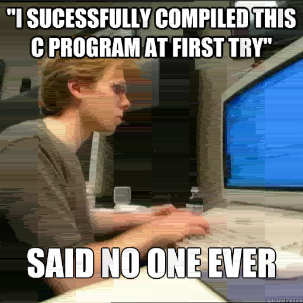

JBK - compression of TGA files
===============================

Table of Contents
=================

- [JBK - compression of TGA files](#jbk---compression-of-tga-files)
- [Table of Contents](#table-of-contents)
- [Introduction](#introduction)
- [Build](#build)
- [Usage](#usage)
  - [Compression](#compression)
  - [Decompression](#decompression)
- [Examples](#examples)
- [JBK Algorithm](#jbk-algorithm)
  - [Compression Process:](#compression-process)
  - [Sequence Representation:](#sequence-representation)
  - [Pixel Similarity:](#pixel-similarity)
- [COMPRESS\_OVER\_U8\_MAX](#compress_over_u8_max)
  - [Without the COMPRESS\_OVER\_U8\_MAX flag](#without-the-compress_over_u8_max-flag)
  - [With the COMPRESS\_OVER\_U8\_MAX flag](#with-the-compress_over_u8_max-flag)
- [Resources](#resources)
  - [Other resources](#other-resources)

Introduction
============

This repository houses JBK, a command-line interface application designed for de/compressing TGA files from/into JBK format. Developed as a semester project for the Introduction to Programming course at VSB-TUO.


Build
====
To build the JBK application, use the following command:
```
$ make
```
Usage
====
Compression
------------
``` bash
$ ./bin/jbk compress --max-diff 2 --input example.tga --output out.jbk --block-size 4
```
or
``` bash
$ ./bin/jbk compress --max-diff 2 --input example.tga --output out.jbk --block-size 4 --COMPRESS_OVER_U8_MAX true
```
For more information about the [COMPRESS_OVER_U8_MAX](#compress_over_u8_max) flag read the respective paragraph.

Here in this example we're compressing `example.tga` file into a compressed `out.jbk.` file. We're compressing with maximum pixel difference of `2` and checking pixel values on scale of block `4x4`. It is important to bear in mind the block size. Both the height and width must be dividable by the block size otherwise the file will not be compressed! But don't worry, if you don't want to calculate divisibility by your self, the application will do it for you.

Decompression
-------------
``` bash
$ ./bin/jbk decompress --input out.jbk --output decompressed.tga
```
In this example we're decompressing file `out.jbk`, back into a TGA file `decompressed.tga`

Examples
========
compression examples

Original image 


image compressed with value of maximum difference 12 and block size 16 (approximately 49.2% of the original file size)


image compressed with value of maximum difference 70 and block size 16 (approximately 7.9% of the original file size)


JBK Algorithm
==============

Image compression in JBK occurs in blocks, square sections of the image with dimensions specified as input. Imagine the image is divided into blocks of size (block size, block size), starting from position (0, 0). Compression is performed independently on each block.

Compression involves traversing pixels in a "row-major" order within a block, starting from the top-left corner and moving right and down. Each block is compressed as if it were an independent image.

Compression Process:
---------------------

1. Create a sequence with the first pixel of the block.
2. Traverse pixels in row-major order, comparing each pixel to the current sequence.
3. If the current pixel is similar to the sequence, increase the sequence length.
4. If not, record the current sequence and create a new sequence with the current pixel.
5. Sequences are created only within a block.

Sequence Representation:
------------------------

A sequence contains the RGB value of the pixel and a number indicating how many times the same (or similar) pixel occurred consecutively within the block. For example, if a 4x4 block consists of only red pixels, it can be compressed into a single sequence with pixel=(255, 0, 0), length=16.

Pixel Similarity:
-----------------

Pixel similarity is determined by the sum of the absolute differences in color components. Two pixels are considered similar if their difference is less than or equal to the specified maximum difference.

COMPRESS_OVER_U8_MAX
====================
There are two different possible implementation of JBK algorithm. You can see the difference your self by building the application with the `COMPRESS_OVER_U8_MAX`.

The difference is in the 'length' calculation. When we're compressing we take a pixel and compare it with the one next to it. If they're similar, we increase the 'length' of the first pixel and compare it to the next one in the sequence. The issue arise when we reach length of 255, since this is the maximum of 8-bit integer which we use to store the length. In the first version of implementation, when we exceed the value of 255 the next pixel is the current one that was being compared, with the `COMPRESS_OVER_U8_MAX` flag the next pixel is the same as the original one. 

Without the COMPRESS_OVER_U8_MAX flag
--------------------------------------


With the COMPRESS_OVER_U8_MAX flag
----------------------------------


Resources
=========
* [Introduction To Programming Scripts](https://mrlvsb.github.io/upr-skripta/c/aplikovane_ulohy/tga.html?highlight=tga#tga)
* [TGA File Format Specification](https://www.dca.fee.unicamp.br/~martino/disciplinas/ea978/tgaffs.pdf)
* [Creating TGA Image files (Paul Bourke, 1996)](http://www.paulbourke.net/dataformats/tga/)
* Data padding:
  * [Structure Member Alignment, Padding, and Data Packing](https://www.geeksforgeeks.org/structure-member-alignment-padding-and-data-packing/)
  * [Microsoft pack pragma](https://learn.microsoft.com/en-us/cpp/preprocessor/pack?view=msvc-170)
  * [GCC Structure Packing Pragmas](https://gcc.gnu.org/onlinedocs/gcc-4.9.3/gcc/Structure-Packing-Pragmas.html#Structure-Packing-Pragmas)

Other resources 
---------------
* [picture used for examples](https://filesamples.com/formats/tga)